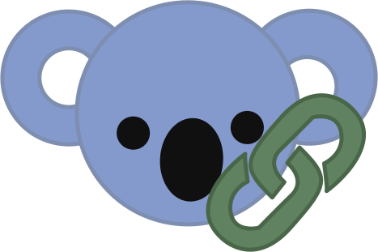

<!-- Improved compatibility of back to top link: See: https://github.com/othneildrew/Best-README-Template/pull/73 -->

<!--
*** Thanks for checking out the Best-README-Template. If you have a suggestion
*** that would make this better, please fork the repo and create a pull request
*** or simply open an issue with the tag "enhancement".
*** Don't forget to give the project a star!
*** Thanks again! Now go create something AMAZING! :D
-->

<!-- PROJECT LOGO -->
 

  

  <h2 align="center"> Lazy-Koala </h2>

  

    <b> Custom URL generator for 
    <a href="koalastothemax.com">koalastothemax. </a> </b>
  

  

     visit: <a href="lazy-koala.vercel.app">lazy-koala.vercel.app </a>
  

<!-- TABLE OF CONTENTS -->

  
Table of Contents

  <ol>
    <li><a href="#about-the-project">About The Project</a></li>
    <li><a href="#how-does-the-generator-work">How Does the Generator Work?</a></li>
    <li><a href="#how-to-get-an-image-url">How to Get an Image URL</a></li>
    <li><a href="#roadmap">Roadmap</a></li>
    <li><a href="#contributing">Contributing</a></li>
    <li><a href="#license">License</a></li>
  </ol>

<!-- ABOUT THE PROJECT -->
## About The Project
A simple html-css-js website that turns image links into playable koalastothemax games, all without having to complete the previous game first, which is the standard on koalastothemax.com. This lack of unnecessary effort is where Lazy-Koala got its name from.

## How does the generator work?
When koalastothemax.com creates a game from a custom image, it uses a system called "[Base64 encoding](https://en.wikipedia.org/wiki/Base64)" to convert your image link into a sequence of letters and numbers. This Base64 encoding is used as the URL path.

This generator does this process automatically and connects it to a usable interface.

## How to get an image URL.
 

#### Upload your own image

<!-- ROADMAP -->
## Roadmap

- [ ] Redirecting directly via url (e.g, lazy-koala.vercel.app/imgur.com/123aaa)
- [ ] Image uploader?

<!-- CONTRIBUTING -->
## Contributing

If you have a suggestion that would make this better, please fork the repo and create a pull request. Your help is greatly appreciated!

For further ideas, open an issue or send me an e-mail via: [contact@brambolt.me](mailto:contact@brambolt.me).

<!-- LICENSE -->
## License

Distributed under the MIT License. See `LICENSE.txt` for more information.

(<a href="#readme-top">back to top</a>)

